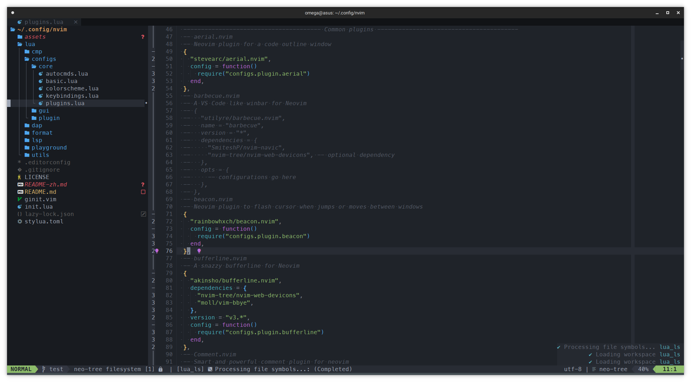

# Neovim 配置文件

这是 MysticalDevil 的 neovim 的配置文件，包含了一些我常用的插件和自定义配置

该配置主要使用 [`lazy.nvim`](https://github.com/folke/lazy.nvim) 进行插件的管理

该配置中的代码编辑的等主要针对 go、rust、javascript、typescript、lua 进行配置，其他语言只使用了 nvim-lsp 的基本功能

## 安装

1. 安装 neovim：
   我主要使用的 Linux 发行版是 Arch、Gentoo、Fedora、Debian，其他发行版请自行查看官方文档。neovim 版本需要 0.10.0 及以上，因为inlay hints 在 0.10.0 之前无法正常工作

   ```bash
   # Arch
   sudo pacman -S neovim

   # Gentoo
   sudo emerge -vj app-editors/neovim

   # Fedora
   sudo dnf install neovim

   # Debian
   sudo apt install neovim

   # Windows
   scoop install neovim

   # macOS
   brew install neovim
   ```

   Debian 12 及以下版本建议自行构建，因为 Debian 官方仓库的 neovim 最新版本为 0.7.2，可以按照如下进行构建

   ```bash
   # Install necessary library
   sudo apt install git cmake ninja-build gettext unzip curl
   # Clone neovim repository
   git clone https://github.com/neovim/neovim.git
   # Enter neovim source directory
   cd neovim
   # Build neovim
   make CMAKE_BUILD_TYPE=RelWithDebInfo
   # Packaged as deb
   cd build && cpack -G DEB
   # Install
   sudo dpkg -i nvim-linux64.deb
   ```

2. 克隆该仓库：

   ```bash
   git clone https://github.com/MysticalDevil/nvim ~/.config/nvim/
   ```

3. 打开 neovim 来安装插件

   ```vim
   Lazy install
   ```

## 目录及文件说明

neovim 如果使用纯 lua 配置，那么配置文件都会集中在 `./lua` 目录中，所以该说明无特殊指定的话根目录指的就是 `./lua/devil` 目录，devil目录是为了防止命名空间冲突

- `init.lua` 使用纯 lua 配置 neovim 时的启动文件
- `ginit.vim` 使用 neovim 前端时加载的额外配置，该配置支持 [`neovide`](https://github.com/neovide/neovide)、[`neovim-qt`](https://github.com/equalsraf/neovim-qt)
- `commands` 一些自定义指令
- `core` 不依赖插件的一些核心配置（AutoCMD，主题，非插件按键配置，启动时的自动动作）
- `configs/plugin` 大多数插件的配置，不包含补全、格式化、DAP、LSP
- `plugins` 插件管理，`plugins/list` 是插件列表和简单配置，分别为通用插件(`common.lua`)，主题(`colorscheme.lua`)，版本控制相关(`git.lua`)以及编程相关(`prog.lua`)。`plugins/configs` 是某些复杂插件的单独配置
- `complete` 补全引擎相关配置，补全引擎默认使用了 [`nvim-cmp`](https://github.com/hrsh7th/nvim-cmp)。代码片段使用了 [`LuaSnip`](https://github.com/L3MON4D3/LuaSnip)，LSP关键字图标采用了 [`lspkind`](https://github.com/onsails/lspkind.nvim)
- `dap` Debug Adapter Protocol 相关配置，主要使用 [`nvim-dap`](https://github.com/mfussenegger/nvim-dap)
- `fmt-lint` 代码格式化和lint相关配置，[`nvim-lint`](https://github.com/mfussenegger/nvim-lint)用于lint [`conform.nvim`](https://github.com/stevearc/conform.nvim)用于格式化
- `lsp` Language Server Protolcol 相关配置，主要使用 [`mason`](https://github.com/williamboman/mason.nvim) 进行 LSP、DAP、Linter、Formmater 等包的管理、[`nvim-lspconfig`](https://github.com/neovim/nvim-lspconfig) 和 [`mason-lspconfig`](https://github.com/williamboman/mason-lspconfig.nvim) 进行 LSP 的配置
- `utils` 常用的工具库，如全局函数，通用配置等
- `playground` 和 `self` 测试用目录，可删除

## 使用

### 快捷键

主要按键配置在 [`keybindings.lua`](./lua/devil/configs/core/keybindings.lua) 和 [`which-key.lua`](./lua/devil/configs/plugin/whick-key.lua) 文件中

以下是一些常用的快捷键

- `<leader>` 键为 `,`
- `<leader>w + ...` 保存文件及衍生操作（如保存并退出）
- `<leader>q + ...` 退出及衍生操作（如强制退出）
- `Ctrl-j/k` 向下/上滚动 5 行
- `Ctrl-d/u` 向下/上滚动 10 行
- `gcc/gcb` 快速注释
- `sv` 水平分屏 `sh` 垂直分屏 `sc` 关闭分屏 `so` 关闭其他分屏
- `Alt-h/j/k/l` 窗口之间跳转
- `ts` 分割标签`th/l/j/k` 前后首尾标签 `tc` 关闭标签
- `Z` 打开代码块 `zz` 关闭代码块 `Leader-f` 格式化代码
- 其他快捷键请参考具体配置

### 插件

以下是一些使用的主要插件

- [`lazy.nvim`](https://github.com/folke/lazy.nvim) 插件管理器，相比 [`packer.nvim`](https://github.com/wbthomason/packer.nvim) 更简单易用、性能更好、配置简单
- [`onedark.nvim`](https://github.com/navarasu/onedark.nvim) 主体颜色，我很喜欢 onedark 配色方案，也可以更改为其他的配色方案
- [`bufferline.nvim`](https://github.com/akinsho/bufferline.nvim) 类似其他编辑器的标签页的插件
- [`Comment.nvim`](`https://github.com/numToStr/Comment.nvim`) 行注释和块注释插件
- [`dashboard-nvim`](https://github.com/glepnir/dashboard-nvim) 更美观的 neovim 的欢迎屏幕，配合 [`project.nvim`](https://github.com/ahmedkhalf/project.nvim) 来快速打开最近项目或文件
- [`lualine.nvim`](https://github.com/nvim-lualine/lualine.nvim) 状态栏插件
- [`neo-tree.nvim`](https://github.com/nvim-neo-tree/neo-tree.nvim) 文件管理器
- [`noice.nvim`](https://github.com/folke/noice.nvim) 通知、命令行、弹出菜单等功能的改进插件
- [`nvim-treesitter`](https://github.com/nvim-treesitter/nvim-treesitter) 语法树、语法高亮
- [`telescope.nvim`](https://github.com/nvim-telescope/telescope.nvim) 查找、筛选、预览、选择插件
- [`gitsigns.nvim`](https://github.com/lewis6991/gitsigns.nvim) 将 git 集成到缓冲区中

## 截图

主屏幕


代码编辑页面



## 贡献

欢迎为我的 neovim 配置文件做出贡献！如果你想要添加新的插件或修改现有配置吗，请进行 pull request

