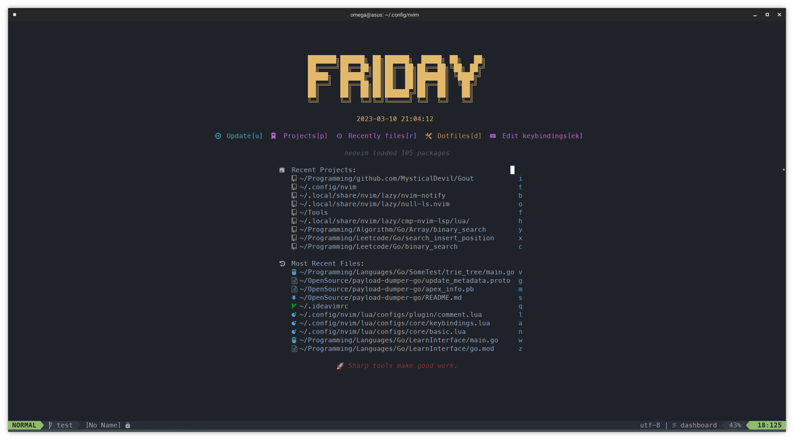
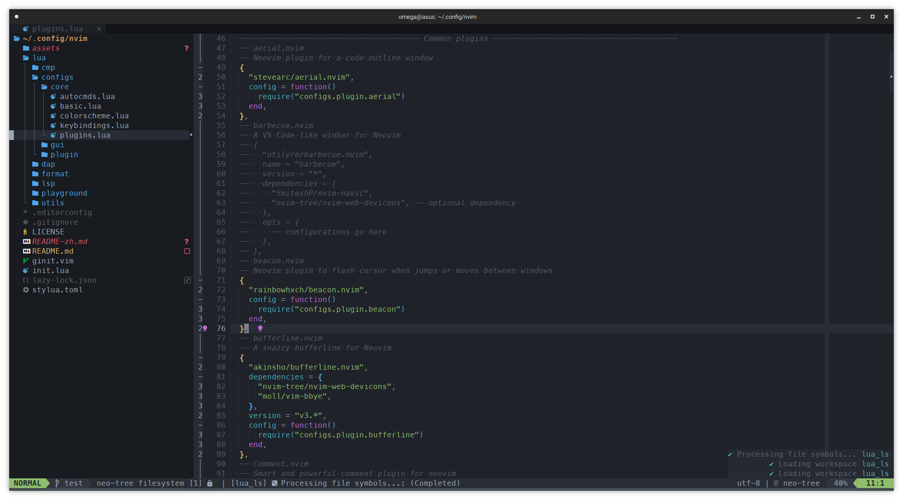

好的,我將 README.md 的內容翻譯成繁體中文:

# Neovim 配置文件

這是 MysticalDevil 的 neovim 的配置文件,包含了一些我常用的插件和自定義配置

該配置主要使用 [`lazy.nvim`](https://github.com/folke/lazy.nvim) 進行插件的管理

該配置中的代碼編輯的等主要針對 go、rust、javascript、typescript、lua 進行配置,其他語言只使用了 nvim-lsp 的基本功能

## 安裝

1. 安裝 neovim:
   我主要使用的 Linux 發行版是 Arch、Gentoo、Debian,其他發行版請自行查看官方文檔。neovim 版本需要 0.10.0(nightly) 及以上,因為 inlay hints 在 0.10.0 之前無法正常工作

   ```bash
   # Arch
   sudo pacman -S neovim

   # Gentoo
   sudo emerge -vj app-editors/neovim

   # Debian
   sudo apt install neovim

   # Windows
   scoop install neovim

   # macOS
   brew install neovim
   ```

   Debian 建議自行構建,因為 Debian 官方倉庫的 neovim 最新版本為 0.7.2,可以按照如下進行構建

   ```bash
   # Install necessary library
   sudo apt install git cmake ninja-build gettext unzip curl
   # Clone neovim repository
   git clone https://github.com/neovim/neovim.git
   # Enter neovim source directory
   cd neovim
   # Build neovim
   make CMAKE_BUILD_TYPE=RelWithDebInfo
   # Packaged as deb
   cd build && cpack -G DEB
   # Install
   sudo dpkg -i nvim-linux64.deb
   ```

2. 克隆該倉庫:

   ```bash
   git clone https://github.com/MysticalDevil/nvim ~/.config/nvim/
   ```

3. 打開 neovim 來安裝插件

   ```vim
   Lazy install
   ```

## 目錄及文件說明

neovim 如果使用純 lua 配置,那麼配置文件都會集中在 `./lua` 目錄中,所以該說明無特殊指定的話根目錄指的是 `./lua/devil` 目錄,devil目錄是為了防止命名空間衝突

- `init.lua` 使用純 lua 配置 neovim 時的啟動文件
- `ginit.vim` 使用 neovim 前端時加載的額外配置,該配置支持 [`neovide`](https://github.com/neovide/neovide)、[`neovim-qt`](https://github.com/equalsraf/neovim-qt)
- `configs/core` 核心配置,主要包括了基礎配置、基本按鍵綁定、插件列表、自定義指令、自定義 autocmd以及第一次啟動時的核心插件安裝
- `configs/colorscheme` 主題配置,包含了多種主題,可以通過 `setup.lua` 來更改預設主題
- `configs/gui` 前端的字體、動畫等配置
- `configs/plugin` 大多數插件的配置,不包含補全、格式化、DAP、LSP
- `plugins` 默認安裝的插件目錄,分別為通用插件(`common.lua`)、主題(`colorscheme.lua`)、版本控制相關(`git.lua`)以及編程相關(`prog.lua`)
- `complete` 補全引擎相關配置,補全引擎默認使用了 [`nvim-cmp`](https://github.com/hrsh7th/nvim-cmp),[`coq_nvim`](https://github.com/ms-jpq/coq_nvim)作為可選項,可以通過`setup.lua`進行切換。代碼片段使用了 [`LuaSnip`](https://github.com/L3MON4D3/LuaSnip) 、LSP關鍵字圖標採用了 [`lspkind`](https://github.com/onsails/lspkind.nvim)
- `dap` Debug Adapter Protocol 相關配置,主要使用 [`nvim-dap`](https://github.com/mfussenegger/nvim-dap)
- `format` 代碼格式化相關配置,默認使用 [`none-ls.nvim`](https://github.com/nvimtools/none-ls.nvim),[`conform.nvim`](https://github.com/stevearc/conform.nvim),[`formatter.nvim`](https://github.com/mhartington/formatter.nvim) 和 [`efm`](https://github.com/mattn/efm-langserver) 作為備選項,可以通過`setup.lua`進行調整
- `lint` 代碼檢查相關配置,默認使用 [`none-ls.nvim`](https://github.com/mfussenegger/none-ls.nvim),[`nvim-lint`](https://github.com/mfussenegger/nvim-lint) 和 [`efm`](https://github.com/mattn/efm-langserver)作為備選項,可以通過`setup.lua`進行調整
- `lsp` Language Server Protolcal 相關配置,主要使用 [`mason`](https://github.com/williamboman/mason.nvim) 進行 LSP、DAP、Linter、Formmater 等包的管理、[`nvim-lspconfig`](https://github.com/neovim/nvim-lspconfig) 和 [`mason-lspconfig`](https://github.com/williamboman/mason-lspconfig.nvim) 進行 LSP 的配置
- `utils` 常用的工具庫,如全局函數,通用配置等

## 使用

### 快捷鍵

主要按鍵配置在 [`keybindings.lua`](./lua/devil/configs/core/keybindings.lua) 和 [`which-key.lua`](./lua/devil/configs/plugin/whick-key.lua) 文件中

以下是一些常用的快捷鍵

- `<leader>` 鍵為 `,`
- `<leader>w + ...` 保存文件及衍生操作(如保存並退出)
- `<leader>q + ...` 退出及衍生操作(如強制退出)
- `Ctrl-j/k` 向下/上滾動 5 行
- `Ctrl-d/u` 向下/上滾動 10 行
- `gcc/gcb` 快速註釋
- `sv` 水平分屏 `sh` 垂直分屏 `sc` 關閉分屏 `so` 關閉其他分屏
- `Alt-h/j/k/l` 窗口之間跳轉
- `ts` 分割標籤`th/l/j/k` 前後首尾標籤 `tc` 關閉標籤
- `Z` 打開代碼塊 `zz` 關閉代碼塊 `Leader-f` 格式化代碼
- 其他快捷鍵請參考具體配置

### 插件

以下是一些使用的主要插件

- [`lazy.nvim`](https://github.com/folke/lazy.nvim) 插件管理器,相比 [`packer.nvim`](https://github.com/wbthomason/packer.nvim) 更簡單易用、性能更好、配置簡單
- [`onedark.nvim`](https://github.com/navarasu/onedark.nvim) 主體顏色,我很喜歡 onedark 配色方案,也可以更改為其他的配色方案
- [`bufferline.nvim`](https://github.com/akinsho/bufferline.nvim) 類似其他編輯器的標籤頁的插件
- [`Comment.nvim`](`https://github.com/numToStr/Comment.nvim`) 行註釋和塊註釋插件
- [`dashboard-nvim`](https://github.com/glepnir/dashboard-nvim) 更美觀的 neovim 的歡迎屏幕,配合 [`project.nvim`](https://github.com/ahmedkhalf/project.nvim) 來快速打開最近項目或文件
- [`leap.nvim`](https://github.com/ggandor/leap.nvim) 文本快速跳轉插件,快捷鍵為 `-` 和 `_`
- [`lualine.nvim`](https://github.com/nvim-lualine/lualine.nvim) 狀態欄插件
- [`neo-tree.nvim`](https://github.com/nvim-neo-tree/neo-tree.nvim) 文件管理器,之前使用的是 [`nvim-tree.lua`](https://github.com/nvim-tree/nvim-tree.lua)
- [`noice.nvim`](https://github.com/folke/noice.nvim) 通知、命令行、彈出菜單等功能的改進插件,有點不穩定
- [`nvim-treesitter`](https://github.com/nvim-treesitter/nvim-treesitter) 語法樹、語法高亮
- [`telescope.nvim`](https://github.com/nvim-telescope/telescope.nvim) 查找、篩選、預覽、選擇插件
- [`gitsigns.nvim`](https://github.com/lewis6991/gitsigns.nvim) 將 git 集成到緩衝區中

## 截圖

主屏幕



代碼編輯頁面



## 貢獻

歡迎為我的 neovim 配置文件做出貢獻!如果你想要添加新的插件或修改現有配置嗎,請進行 pull request
